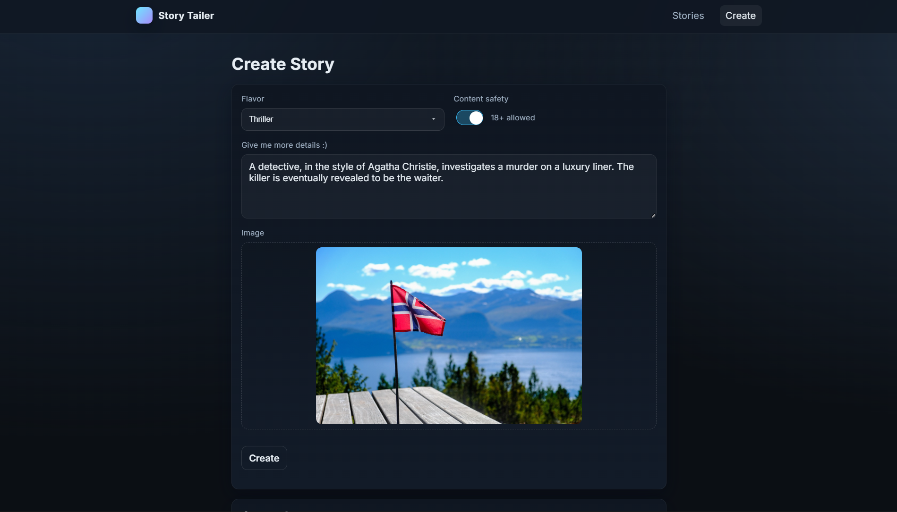
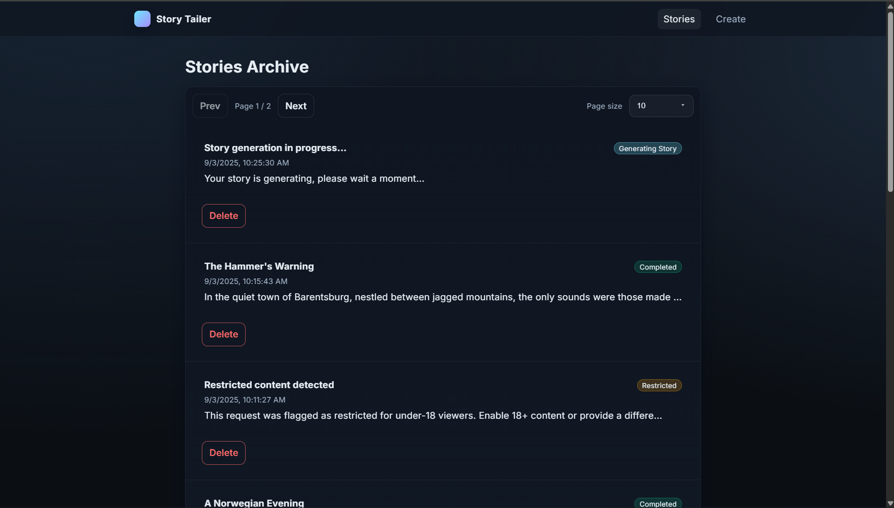

## Story Tailer

A small proof‑of‑concept where you upload an image and get back a short story with generated narration. It’s not trying to be perfect - just enough to show the flow end‑to‑end and a bit of taste in the details.

### Screenshots


</br>

</br>

</br>


### What’s inside

- **Backend**: FastAPI, Celery worker, MongoDB (Motor), RabbitMQ, Pydantic, LangChain + Ollama; Piper TTS for audio
- **Frontend**: React + Vite + TypeScript
- **Containers**: Docker Compose orchestrating services (Mongo, Mongo Express, RabbitMQ, backend, worker, frontend)

### How it works

1. The UI sends an image and a few options to the API; a placeholder “in progress” story is created.
2. A Celery task asks a local Ollama VLM for insights from the image, then writes a short story.
3. The text is synthesized into speech with Piper TTS.

## Run locally

### Prerequisites

- Docker and Docker Compose
- Ollama running locally (listening on `http://localhost:11434`). If needed, pull the models used by default:
  - `qwen2.5vl:7b` (vision) and `qwen2.5:7b` (text)
  - Start the server with `ollama serve`
- First run only (if the network doesn’t exist): `docker network create story-tailer-net`

### Start

```bash
make run
```

- Frontend: [http://localhost:5173](http://localhost:5173)
- Backend (OpenAPI): [http://localhost:8000/docs](http://localhost:8000/docs)
- Mongo Express: [http://localhost:8081](http://localhost:8081)

Useful:

```bash
make logs   # follow logs for all services
make down   # stop everything
```

### Configuration notes

- The backend expects Ollama at `http://host.docker.internal:11434` (mapped via Docker’s host gateway). You can change this with `OLLAMA_URL` in the compose files.
- MongoDB and RabbitMQ addresses are set via environment variables in the compose files.

## Tech details (short)

- FastAPI app exposes REST endpoints; Celery offloads generation to a worker.
- LangChain’s `ChatOllama` talks to Ollama for both VLM (image + text) and text‑only prompts.
- Piper TTS downloads an English voice in the backend image and outputs narration.
- Assets (images/audio) are stored on disk; metadata and status live in MongoDB.

----
@kinfi4
